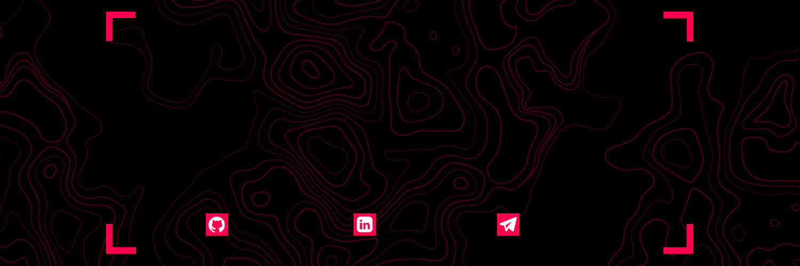

  
  

### :hammer_and_wrench: Habilidades
  <h4>Tenho experiência:</h4>
    
    
  <h4>Estou estudando:</h4>
    
    
    
  <h4>Quero aprender:</h4>
    
    
    
    
    
    

### :fire: Estatísticas
  
  
  
